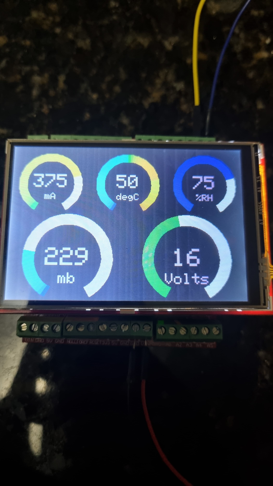

# WIP

(i) *EML327 Bluetooth*

- senha pareamento: 1234

(i) *HC-06 Bluetooth*

- senha pareamento: 0000

(i) *Libs Usadas*:

- https://github.com/adafruit/Adafruit_BusIO
- https://github.com/adafruit/Adafruit-GFX-Library
- https://github.com/adafruit/Adafruit_TouchScreen
- https://github.com/prenticedavid/MCUFRIEND_kbv

(i) *Links que contribuiram*:

- https://embarcados.com.br/barramento-can-entre-arduinos-uno/

- https://www.youtube.com/watch?v=Zl3IvfNaafA

- https://stackoverflow.com/questions/17468652/how-can-i-make-continuous-communication-with-obd-ii-elm327-adapter

- https://www.arduino.cc/reference/pt/language/functions/communication/serial/

- https://www.blafusel.de/obd/obd2_pid.php

- https://www.instructables.com/Arduino-analogue-ring-meter-on-colour-TFT-display/#step